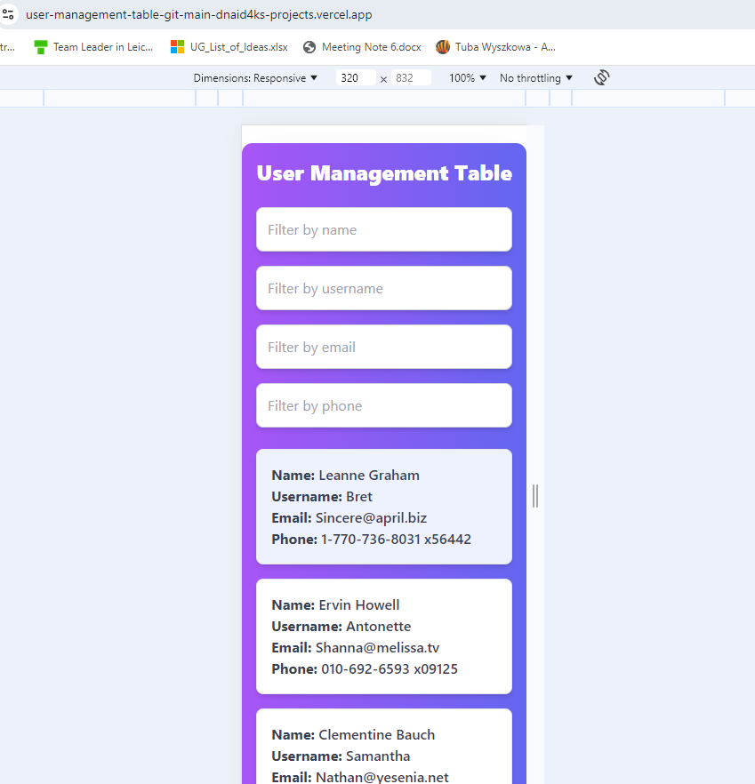

# User Management Application

This is a **User Management** application built with **React** and **TypeScript**. The application utilizes **Redux Toolkit** for state management, **Axios** for data fetching, and **Tailwind CSS** for styling. It is designed to be **mobile-friendly** and responsive. The project is deployed using **Vercel**.

## Features

- Display a list of users fetched from an external API.
- Filter users by name, username, email, and phone.
- Responsive design with a mobile-friendly interface.
- State management using Redux Toolkit.
- Styled using Tailwind CSS for rapid and modern styling.

## Technologies Used

- **React**: JavaScript library for building user interfaces.
- **TypeScript**: Typed superset of JavaScript for more robust code.
- **Redux Toolkit**: State management library.
- **Axios**: HTTP client for API requests.
- **Tailwind CSS**: Utility-first CSS framework for styling.
- **Vercel**: Platform for deploying front-end projects.

live link: https://user-management-table-git-main-dnaid4ks-projects.vercel.app/
